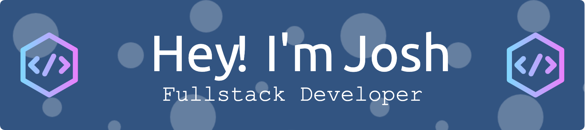

## Welcome to my GitHub profile!

I'm an aspiring web developer passionate about writing clean, efficient, and impactful code. I love exploring the synergy between technology and creativity, crafting solutions that not only solve problems but also delight users. Here's a bit about me:

	<code></code>

	<code></code>

	<code></code>

### 🛠 Tech Stack

	<code></code>
	<code></code>
	<code></code>
	<code></code>
	<code></code>
	<code></code>
	<code></code>
	<code></code>
	<code></code>
	<code></code>
	<code></code>
	<code></code>
	<code></code>
	<code></code>
	<code></code>
	<code></code>
	<code></code>
	<code></code>
	<code></code>
	<code></code>
	<code></code>
	<code></code>
	<code></code>
	<code></code>
	<code></code>
	<code></code>
	<code></code>
	<code></code>
	<code></code>
	<code></code>
	<code></code>
	<code></code>
	<code></code>
	<code></code>
	<code></code>
	<code></code>
	<code></code>
	<code></code>
	<code></code>
	<code></code>
	<code></code>
	<code></code>
	<code></code>
	<code></code>
	<code></code>
	<code></code>

### 🌱 I’m currently learning

- Advancing my skills in Python, React and diving deeper into the modern JavaScript ecosystem.
- Exploring full-stack development to understand both client-side and server-side intricacies.
- Enhancing my workflow automation scripts to streamline my development process.

### 💡 Projects

- **Web Development Portfolio**: A collection of my web development projects showcasing my skills in Python, React, JavaScript, and responsive design.
- **Automation Scripts**: A series of useful scripts written in Python to automate mundane tasks and increase productivity.
- **Neovim Config**: My personalized Neovim setup, optimized for web development with integrated support for JavaScript, React, and Python.

### 🚀 Goals

- To become a proficient full-stack developer, skilled in creating end-to-end web applications.
- Continuously learn and adapt to the ever-evolving web technologies landscape.
- Develop open-source projects that can help the community or contribute to existing impactful projects.

### 😄 Fun Facts

- I'm a big fan of automating everything I can to make time for exploring new technologies.
- Love diving into documentation and getting lost in the endless learning.
- I'm a huge music nerd

### 📫 How to reach me

- Feel free to fork, star, or contribute to any of my repositories. Collaboration is key!
- Check out my [CodePen](https://codepen.io/joshuadanpeterson/collections/) and my [Replit](https://replit.com/@joshuadanpeterson)!
- Drop me an [email](mailto:joshuadanpeterson@gmail.com) or connect with me on [LinkedIn](https://www.linkedin.com/in/joshuadanpeterson) for any exciting opportunities or just to chat about tech!

### Look me up on [LeetCode](https://leetcode.com/joshuadanpeterson/)!

	<code></code>

Let's code, create, and collaborate!

***

	<code></code>

